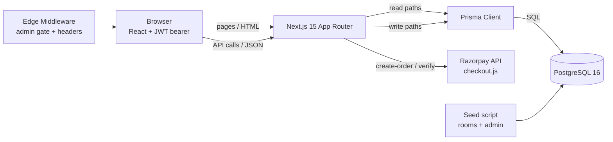
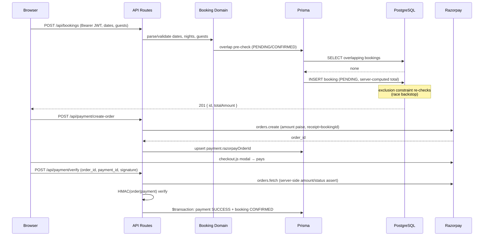

# Architecture

Interactive system map: run the app and open **/docs** — animated data-flow diagram where every travelling dot is a clickable, inspectable payload.

Static equivalents below (Mermaid, rendered on GitHub).

## System context



## Repository layout

```
Vanprastha-Resorts/
├── app/                      # Next.js App Router — one folder per URL route
│   ├── admin/                #   admin pages (layout + dashboard + 4 CRUD screens)
│   ├── api/                  #   route handlers — the ONLY mutation surface
│   │   ├── admin/            #     admin CRUD (role re-checked per request)
│   │   ├── auth/             #     register/login/me/logout
│   │   ├── bookings/         #     create + cancel (owner-scoped)
│   │   ├── payment/          #     create-order + verify (order-bound)
│   │   ├── rooms/            #     public catalog for the booking wizard
│   │   └── availability/     #     boolean overlap check
│   ├── book/ docs/ login/ profile/ register/ rooms/
│   └── page.tsx              #   homepage
├── components/
│   ├── admin/  auth/  booking/  docs/  home/  layout/  rooms/  ui/
│   └── ui/                   #   design system: button, card, badge, container
├── lib/
│   ├── server/               #   Node-only domain logic: prisma, auth, admin,
│   │                         #   errors, booking, razorpay, room-schema
│   ├── shared/               #   Isomorphic types: api types, content types, map data
│   └── utils.ts              #   Client-safe helpers (cn, formatINR, apiFetch, cookie const)
├── data/                     # Static editorial content (offers, amenities, …)
├── docs/                     # ARCHITECTURE.md, STATUS.md
├── prisma/                   # schema.prisma, migrations/, seed.ts
├── public/images/            # rooms/, gallery/, experiences + brand assets
├── scripts/                  # db-setup.ps1, verify-api.ps1, generate-images.mjs
├── styles/                   # globals.css, tailwind.config.ts
├── tests/                    # unit/ (pure domain) + integration/ (real PG)
└── middleware.ts             # /admin/* cookie gate + security headers
```

Rules that keep it honest:

- **Every module has one consumer direction.** `lib/server/*` is imported only by route handlers and server components; `lib/shared/*` by both sides; `components/ui/*` only by other components.
- **The API layer is the only mutation surface.** Server components read the DB directly for pages (fast, no round-trip); every write goes through a validated, authenticated route handler.
- **No dead endpoints.** The API tree above is the complete set; each one is exercised by the e2e suite (`scripts/verify-api.ps1`).
- **One type per concept.** `lib/shared/types.ts` is the single source for `RoomDto` / `BookingDto`; components never redefine them.

## Layers

| Layer | Paths | Responsibility |
|---|---|---|
| Browser | `components/*`, `app/*/page.tsx` (client parts) | Booking wizard, profile, admin tables, session storage |
| Edge middleware | `middleware.ts` | `/admin/*` cookie gate, CSP + security headers |
| Server components | `app/rooms/*`, `app/admin/page.tsx`, `app/page.tsx` | Read paths — direct Prisma queries, zero client fetch |
| API routes | `app/api/*` | All mutations: auth, bookings, payments, availability, admin CRUD |
| Domain libs | `lib/server/*` | Auth (JWT/bcrypt/cookies), booking math, payment binding, zod schemas, error mapping |
| Data | `prisma/*`, `lib/server/prisma.ts` | Schema, migrations, seed; type-safe client |
| Static content | `data/*` | Editorial marketing content (offers, amenities, testimonials, gallery) — intentionally not in the DB |

## Booking + payment sequence



## Data model

```mermaid
erDiagram
    USER ||--o{ BOOKING : books
    ROOM ||--o{ BOOKING : hosts
    BOOKING ||--o| PAYMENT : settles

    USER {
        string id PK
        string email UK
        string password "bcrypt"
        string role "USER | ADMIN"
    }
    ROOM {
        string id PK
        string slug UK
        string title
        int capacity
        int pricePerNight
        string[] highlights
        bool isActive
    }
    BOOKING {
        string id PK
        string status "PENDING|CONFIRMED|CANCELLED"
        timestamp checkIn
        timestamp checkOut
        int totalAmount "server-computed"
    }
    PAYMENT {
        string id PK
        string bookingId FK UK
        string status "PENDING|SUCCESS|FAILED"
        string razorpayOrderId
        string razorpayPaymentId
    }
```

## Integrity rules

- **Bookings are immutable financial records**: `bookings.userId`, `bookings.roomId`, `payments.bookingId` are all `ON DELETE RESTRICT`. Rooms with history can only be deactivated (`isActive=false`); users with bookings can never be deleted.
- **Double-booking is impossible even under concurrency**: partial exclusion constraint `bookings_no_overlap` (btree_gist) on `(roomId, tsrange(checkIn, checkOut, '[)'))` restricted to `PENDING`/`CONFIRMED` rows — half-open, so the check-out day is reusable. The API pre-check (same semantics) gives friendly 409s; the constraint is the race backstop (proven by `tests/integration/constraint.test.ts`, including the checkout-day-reuse boundary case).
- **Status machine**: `PENDING → CONFIRMED | CANCELLED`. Users may only modify/cancel their own PENDING bookings. Cancelled bookings never revive — which is what makes the partial constraint sound.
- **Payment binding**: the order id is persisted before checkout; verification derives the booking from the *stored* order id (never the client), re-fetches the order server-side, asserts amount×100/currency/status, HMAC-checks the signature, and confirms atomically and idempotently.
- **Admin authority**: JWT role claims are never trusted alone — every admin route re-reads the role from the DB (`lib/server/admin.ts`). Self-demotion is blocked.
- **No internal leakage**: `handleApiError` maps failures centrally; 5xx never includes internals; constraint collisions surface as clean 409s.
